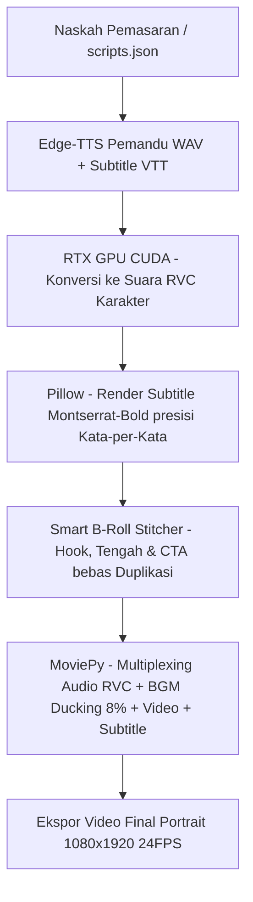

# 🎬 AutoVideo-RVC: AI Short-Form Video Generator with Local RVC Voiceover 🚀

[](https://www.python.org/)
[](https://developer.nvidia.com/cuda-toolkit)
[](https://opensource.org/licenses/MIT)
[](https://github.com/RVC-Project/Retrieval-based-Voice-Conversion-WebUI)

**AutoVideo-RVC** adalah generator video pendek vertikal (9:16) otomatis untuk TikTok, Instagram Reels, dan YouTube Shorts yang berjalan 100% lokal. 

Aplikasi ini menggabungkan **Edge-TTS** (audio narasi), **RVC V2** yang diakselerasi GPU NVIDIA (CUDA) untuk mengubah vokal secara offline, **Pillow** untuk me-render subtitle dinamis, dan **MoviePy** untuk penyusunan klip B-roll tanpa adegan ganda.

---

## 🎨 Tampilan Aplikasi (Visual Showcase)

### 🚀 AutoVideo-RVC Studio: Batch Rendering Dashboard
Antarmuka pemrosesan video massal secara *real-time* lengkap dengan progress bar dan terminal log:


### 🖥️ AutoVideo-RVC Studio: Dashboard & Workspace
Konfigurasi direktori masukan/keluaran, status aset, dan pengelola profil workspace:


---

## ✨ Fitur Utama

* **🔊 Local RVC GPU Voice Changer**: Mengubah suara narator bawaan menjadi karakter lain secara instan dan offline via GPU NVIDIA (CUDA).
* **🎛️ Golden Balance Speech**: Pengaturan tempo suara narator (+20% speed) agar durasi video pas dan menjaga perhatian penonton.
* **🏷️ Zero-Duplicate B-Roll Stitcher**: Penyusunan klip produk dengan memilah bagian Hook (awal) dan CTA (akhir), serta menyaring klip yang sudah terpakai agar adegan tidak berulang.
* **💬 Dynamic Subtitles**: Subtitle tebal dengan outline hitam kontras, dibatasi maksimal 2 kata per kemunculan dan tersinkronisasi presisi kata-per-kata.
* **🎵 Auto-Music Mix & Ducking**: Shuffle musik latar secara acak dengan penyesuaian volume otomatis (turun ke 8% saat narator berbicara).
* **📊 Copywriting Framework**: Naskah promosi disusun otomatis berdasarkan formula terstruktur: Promo, PAS, FAB, BAB, dan Hardselling.

---

## 📂 Deteksi Produk & Multi-Generate Otomatis (Smart Workspace Mapping)

Aplikasi dapat membaca nama produk dan memilah B-roll berdasarkan struktur subfolder di dalam folder **`video_input/`**:

1. **Pemetaan Subfolder**: Folder di dalam `video_input/` otomatis dicocokkan dengan produk yang diproses (contoh: subfolder `video_input/POC Cabai/` akan dipetakan untuk produk *"POC Cabai"*).
2. **Dynamic B-Roll Isolation**: Generator hanya akan mengambil klip dari subfolder produk aktif untuk menghindari penggunaan klip produk lain (*cross-product leakage*).
3. **Multi-Product Rendering**: Mendukung rendering massal untuk beberapa produk berbeda sekaligus dalam satu antrean.
4. **Fallback System**: Jika subfolder produk kosong, generator akan mengambil klip di folder utama `video_input/` sebagai cadangan agar rendering tidak terputus.

---

## 🧠 Framework Copywriting & TikTok Hook

Untuk menjaga kualitas naskah iklan dan retensi penonton, AI Copywriter Studio memformulasikan naskah video pendek menggunakan kerangka kerja copywriting standar industri:

### 🎯 1. AIDA (Attention, Interest, Desire, Action)
* **Attention (0-3 Detik)**: Pancing perhatian penonton di awal video lewat kalimat pembuka (*hook*) yang kuat.
* **Interest (3-7 Detik)**: Bangun ketertarikan dengan memaparkan fakta, data, atau masalah yang relevan dengan penonton.
* **Desire (7-12 Detik)**: Picu keinginan membeli dengan menyajikan transformasi nyata atau nilai unggul produk.
* **Action (12-20 Detik)**: Ajakan bertindak (CTA) yang jelas untuk mengarahkan penonton melakukan pembelian (seperti klik keranjang kuning).

### ⚡ 2. PAS (Problem, Agitate, Solve)
* **Problem**: Mengangkat masalah utama atau keresahan yang sering dialami calon pembeli.
* **Agitate**: Memperjelas efek buruk dari masalah tersebut agar terasa mendesak untuk diselesaikan.
* **Solve**: Memperkenalkan produk sebagai solusi praktis dan andal untuk mengatasi masalah tersebut.

### 💎 3. FAB (Features, Advantages, Benefits)
* **Features**: Menyebutkan spesifikasi fisik, kandungan, atau fitur utama produk.
* **Advantages**: Menerangkan mengapa spesifikasi atau fitur tersebut lebih unggul dibanding opsi lain di pasar.
* **Benefits**: Menjelaskan manfaat nyata yang dirasakan langsung oleh pembeli dalam kehidupan sehari-hari.

### 🌉 4. BAB (Before, After, Bridge)
* **Before**: Menggambarkan situasi sulit atau keluhan sebelum menggunakan produk.
* **After**: Menunjukkan situasi setelah menggunakan produk secara rutin.
* **Bridge**: Memosisikan produk sebagai kunci utama yang mewujudkan transformasi tersebut.

### 🧲 5. TikTok Hook (Golden 3-Second Rule)
Kalimat pembuka di 3 detik pertama dirancang untuk memicu rasa penasaran penonton guna menekan angka geser (*swipe-away rate*) dan meningkatkan skor *watch completion rate* pada algoritma media sosial.

---

## ⚙️ Arsitektur Aliran Data (Dataflow Architecture)

Alur kerja otomatisasi pemrosesan video:



---

## 🖥️ AutoVideo-RVC Studio: PySide6 Desktop GUI

Aplikasi desktop berbasis **PySide6 (Qt6)** dengan desain *Dark Mode* modern yang elegan memberikan kontrol penuh untuk:

* **✍️ AI Copywriter Studio**: Menyusun puluhan naskah promosi secara dinamis menggunakan framework copywriting (**AIDA, PAS, FAB, BAB**).
* **🎨 Live Layout Editor (9:16 Canvas Simulator)**: Kustomisasi font (.ttf), warna subtitle (kuning, putih, hijau, cyan), tebal stroke, posisi vertikal, watermark, dan jenis transisi video.
* **🎙️ Cloud Trainer Bridge**: Setelan pitch, index, dan jembatan ekspor dataset RVC langsung ke Google Colab.
* **🚀 Background Batch Renderer**: Menjalankan komposisi MoviePy di background thread (**QThread**) agar GUI tidak freeze.

---

## 🛠️ Panduan Instalasi (Lokal Windows)

Langkah pemasangan secara lokal pada Python 3.12:

### 1. Klon Repositori & Setup Environment
```bash
git clone https://github.com/brillianodhiya/AutoVideo-RVC.git
cd AutoVideo-RVC
python -m venv venv
venv\Scripts\activate
```

### 2. Instalasi PyTorch & CUDA Toolkit
Pastikan GPU NVIDIA aktif dan CUDA Toolkit terinstal, kemudian jalankan:
```bash
pip install torch torchvision torchaudio --index-url https://download.pytorch.org/whl/cu121
```

### 3. Instalasi Dependensi Core & Library Machine Learning
```bash
pip install numpy==1.26.4 edge-tts Pillow moviepy PySide6
```

### 4. Instalasi RVC Engine & Pustaka Fairseq
Instal rvc-python dan modul Fairseq menggunakan *pre-compiled wheel* Windows untuk mencegah error kompilasi C++:
```bash
pip install rvc-python
pip install https://github.com/BlueAmulet/fairseq/releases/download/ci_build/fairseq-0.13.2-cp310-cp310-win_amd64.whl
```

### 5. Pengunduhan Base Models (RVC Dependencies)
Jalankan script Python berikut sekali untuk mengunduh model dasar secara otomatis:
```python
from rvc_python.dependency import download_dependencies
download_dependencies()
```

---

## 📦 Mengompilasi Aplikasi Desktop ke Executable (Optional)

Aplikasi ini dapat dibungkus menjadi file mandiri (*standalone executable*) menggunakan **PyInstaller**:
```bash
pip install pyinstaller
```

### Perintah Kompilasi:

#### 🪟 Windows (.exe)
```bash
pyinstaller --noconsole --onefile --name="AutoVideoRVC" --add-data "fonts;fonts" --add-data "icons;icons" --add-data "ind.traineddata;." app_gui.py
```

#### 🍏 macOS (.app bundle)
```bash
pyinstaller --noconsole --onefile --windowed --name="AutoVideoRVC" --add-data "fonts:fonts" --add-data "icons:icons" --add-data "ind.traineddata:." app_gui.py
```

#### 🐧 Linux (Executable binary)
```bash
pyinstaller --noconsole --onefile --name="AutoVideoRVC" --add-data "fonts:fonts" --add-data "icons:icons" --add-data "ind.traineddata:." app_gui.py
```
*Catatan: Parameter `--add-data` memastikan font, ikon, dan file bahasa OCR ikut dibungkus ke dalam folder `dist/`.*

---

## 📋 Status Pengujian & Integrasi Fitur (Feature Matrix)

Status pengujian komponen kecerdasan buatan (AI) dan rendering saat ini:

| Fitur / Komponen | Engine Integrasi | Status Pengujian | Keterangan |
| :--- | :--- | :--- | :--- |
| **🤖 LLM AI Generator** | **Ollama (`gemma:2b` / `gemma4:31b`)** | **🟢 Tested & Working!** | Berhasil membuat naskah promosi secara lokal dengan format JSON secara cepat. |
| **🤖 LLM AI Generator** | **Google Gemini API** | **🟡 Implemented (Untested)** | Integrasi API terpasang, siap digunakan setelah API Key dimasukkan. |
| **🤖 LLM AI Generator** | **OpenRouter API** | **🟡 Implemented (Untested)** | Integrasi API terpasang, siap digunakan setelah API Key dimasukkan. |
| **🎙️ RVC Settings** | **RVC GUI Local Inference** | **🟢 Tested & Working!** | Konversi suara VO bawaan menjadi karakter RVC berhasil menggunakan GPU NVIDIA lokal. |
| **🎙️ RVC Settings** | **RVC Desktop Local Trainer** | **🟡 Implemented (Untested)** | Dataset creator di GUI sudah siap, pelatihan lokal belum diuji karena keterbatasan dataset tes lokal. |
| **☁️ Cloud Trainer Bridge**| **Google Colab Notebook (`RVC_Colab_Trainer.ipynb`)** | **🟡 Experimental (In Optimization)**| Notebook menggunakan venv Python 3.10 mandiri untuk memintas ketidakcocokan dependensi `numba` di Python 3.12 bawaan Colab. |

---

## 🤝 Mari Berkontribusi & Roadmap Pengembangan (Upcoming Features)

Proyek ini bersifat open-source! Kontribusi untuk pengembangan fitur baru atau perbaikan bug sangat diterima:

### 💡 Rencana Pengembangan Terdekat (Official Roadmap):
* [ ] **🔀 Layout Editor Drag-n-Drop**: Penataan letak subtitle, logo watermark, dan stiker promosi secara visual pada simulator layar HP 9:16 di PySide6.
* [ ] **🌐 Dukungan Multi-Bahasa (Upcoming)**: Penambahan suara narator selain Bahasa Indonesia lengkap dengan penyelarasan tanda batas kata (*word boundary*).
* [ ] **🤖 Integrasi Multi-AI Provider**: Akses ke model API eksternal (DeepSeek, Claude) serta inferensi lokal menggunakan Llama.cpp (GGUF).
* [ ] **📦 Portable Standalone Executables**: Pembangunan paket distribusi aplikasi mandiri yang dioptimalkan ukurannya:
  * [ ] Portable Windows Standalone Installer & `.exe`
  * [ ] Lightweight Linux AppImage & executable binary
  * [ ] Fully packaged macOS `.dmg` installer & `.app` bundle
* [ ] **🎨 SaaS-Themed Iconography & Logo Update**: Pembaruan paket ikon antarmuka dan logo aplikasi bergaya minimalis modern.
* [ ] **☁️ Cloud Trainer Bridge (Colab Optimization)**: Penyempurnaan alur ekspor dataset satu klik dan stabilitas lingkungan Google Colab.

* [ ] **🎙️ Local Voice Cloning UI (1-Click Trainer)**: Dasbor rekaman dataset suara mandiri untuk pembuatan klon suara kustom secara offline.
* [ ] **🎯 AI B-Roll Content-Aware Tagging**: Integrasi model visi komputer ringan (YOLO/MobileNet) untuk memindai dan menandai klip video mentah agar sesuai dengan teks naskah.
* [ ] **⚡ Serverless Cloud Rendering Pipeline**: Opsi rendering MoviePy menggunakan GPU cloud serverless (RunPod / Replicate) untuk pengguna dengan spesifikasi PC rendah.
* [ ] **🎵 Smart Sound FX Auto-Stitcher**: Penyisipan efek suara transisi estetik secara otomatis pada setiap pergantian adegan atau kalimat.
* [ ] **📅 Automated Social Media Scheduler**: Penjadwalan posting konten otomatis langsung ke API TikTok, Instagram, dan YouTube Shorts.

Silakan ajukan *Pull Request* atau buka *Issue* di repositori **[brillianodhiya/AutoVideo-RVC](https://github.com/brillianodhiya/AutoVideo-RVC)** jika menemukan bug atau ingin berdiskusi mengenai fitur baru.

---

## 📄 Lisensi

Proyek ini dilisensikan di bawah **[MIT License](LICENSE)**.

---

*Dibuat dengan ❤️ untuk kemajuan kreator konten lokal oleh [brillianodhiya](https://github.com/brillianodhiya).*
