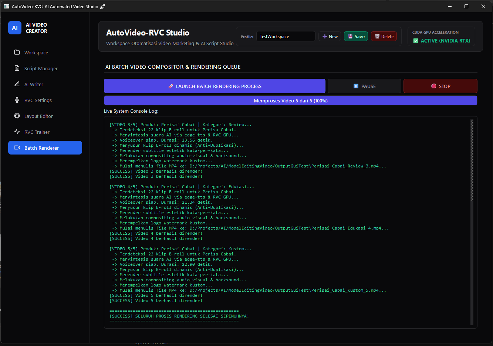
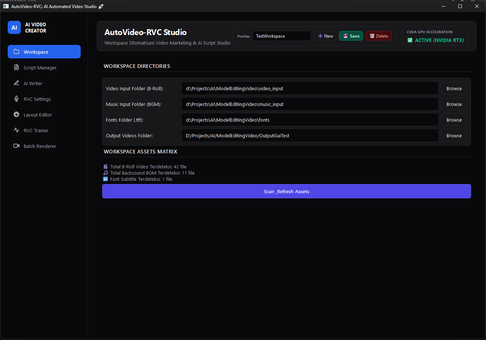
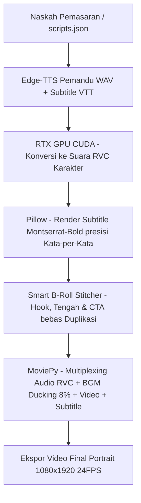

# 🎬 AutoVideo-RVC: AI Short-Form Video Generator with Local RVC Voiceover 🚀

[](https://www.python.org/)
[](https://developer.nvidia.com/cuda-toolkit)
[](https://opensource.org/licenses/MIT)
[](https://github.com/RVC-Project/Retrieval-based-Voice-Conversion-WebUI)

**AutoVideo-RVC** adalah sebuah *automated post-production engine* premium untuk memproduksi video pendek vertikal secara massal (format 9:16 untuk TikTok, Instagram Reels, dan YouTube Shorts) 100% secara lokal. 

Proyek ini menggabungkan kekuatan **Edge-TTS** (suara narator alami), **RVC (Retrieval-based Voice Conversion) V2** terakselerasi GPU NVIDIA (CUDA) untuk mengubah vokal menjadi karakter imut/premium, **Pillow** untuk render subtitle Montserrat-Bold dinamis bergaya Gen-Z, dan **MoviePy** untuk visual-audio stitching cerdas bebas duplikasi adegan.

---

## 🎨 Preview & Tampilan Aplikasi (Visual Showcase)

### 🚀 AutoVideo-RVC Studio: Batch Rendering Dashboard
Tampilan antarmuka pemrosesan video massal (*Batch Rendering*) secara *real-time* lengkap dengan indikator kemajuan (*Progress Bar*) dan terminal konsol terintegrasi:



### 🖥️ AutoVideo-RVC Studio: Dashboard & Workspace
Tampilan utama konfigurasi direktori masukan/keluaran, pemindaian status aset secara *real-time*, dan pengelola profil workspace global:



---

## ✨ Fitur Utama

* **🔊 Local RVC GPU Voice Changer:** Mengubah suara narator bawaan menjadi karakter imut (seperti Furina/anime) secara instan dan offline menggunakan kartu grafis NVIDIA (CUDA).
* **🎛️ Golden Balance Speech (+20% Speed):** Kecepatan suara pemandu disesuaikan secara proporsional untuk menjaga tingkat retensi audiens tetap tinggi di media sosial.
* **🏷️ Zero-Duplicate Smart B-Roll Stitcher:** Algoritma scene pooling yang secara otomatis menyortir klip produk di awal video (Hook) & akhir video (CTA), serta menyaring klip yang sudah terpakai agar tidak ada adegan yang berulang.
* **💬 Dynamic Gen-Z Subtitles:** Subtitle tebal berwarna kuning cerah dengan garis luar (*outline*) hitam solid, dibatasi maksimal 2 kata per cue secara presisi (sinkronisasi kata-per-kata menggunakan *word boundary*).
* **🎵 Auto-Music Mix & Ducking:** Backsound dipilih acak dan volumenya diturunkan secara dinamis hingga **8% (ducking)** saat suara AI sedang berbicara agar narasi terdengar jelas dan profesional.
* **📊 Strict Marketing Framework:** Naskah diatur secara ketat mengikuti kerangka kerja pemasaran digital berkonversi tinggi: **Promo, Problem-Solution, Edukasi, Testimoni, dan Hardselling / Duet Bundling**.

---

## 📂 Deteksi Produk & Multi-Generate Otomatis (Smart Workspace Mapping)

Aplikasi memiliki mesin pemetaan cerdas yang mendeteksi nama produk dan mengelompokkan klip video secara otomatis hanya dengan membaca struktur subfolder di dalam direktori **`video_input/`**. Fitur ini mendukung pembuatan video multi-produk secara massal dalam satu sesi rendering (*Multi-Generate*):

1. **Pemetaan Nama Folder Berbasis Produk**: Setiap subfolder di dalam direktori `video_input/` berfungsi sebagai penampung B-roll unik untuk produk tertentu. Nama subfolder dicocokkan secara otomatis dengan produk yang sedang diproses (contoh: subfolder `video_input/POC Cabai/` akan secara otomatis dipetakan sebagai aset video khusus produk *"POC Cabai"*).
2. **Dynamic B-Roll Isolation & Scene Pooling**: Saat memproses naskah untuk produk tertentu, sistem secara dinamis mengisolasi folder masukan. Generator hanya akan mengambil, merotasi, dan menjahit klip video mentah yang berada di dalam subfolder produk bersangkutan. Langkah ini mencegah terjadinya kebocoran adegan antar produk (*cross-product scene leakage*).
3. **Multi-Product Batch Rendering**: Memungkinkan pembuatan puluhan video promosi unik untuk berbagai produk berbeda secara bersamaan dalam satu baris antrean. Sistem akan membaca naskah, mencocokkan kata kunci nama produk ke folder yang sesuai, lalu mengeksekusi rendering berurutan secara otomatis tanpa intervensi manual.
4. **Subfolder Fallback System**: Jika subfolder khusus produk tidak ditemukan atau kosong, sistem secara otomatis akan menggunakan direktori root `video_input/` atau folder kategori sebagai cadangan (*fallback*) agar antrean rendering tidak terputus.

---

## 🧠 Framework Copywriting & TikTok Hook

Untuk menjamin konversi pemasaran yang maksimal dan tingkat retensi penonton yang tinggi, AI Copywriter Studio memformulasikan naskah video pendek menggunakan kerangka kerja copywriting standar emas industri:

### 🎯 1. AIDA (Attention, Interest, Desire, Action)
Framework pemasaran klasik berbasis corong (*funneling*) yang dirancang untuk mengarahkan psikologi penonton dari sadar hingga membeli:
* **Attention (0-3 Detik)**: Memicu perhatian instan melalui kalimat pemancing (*hook*) visual dan audio yang tajam.
* **Interest (3-7 Detik)**: Membangun ketertarikan dengan memaparkan fakta unik, data menarik, atau masalah yang sangat relevan dengan keseharian penonton.
* **Desire (7-12 Detik)**: Memicu keinginan membeli dengan menyajikan transformasi emosional, nilai unggul produk, atau testimoni yang kuat.
* **Action (12-20 Detik)**: Ditutup dengan *Call to Action* (CTA) yang jelas, tegas, dan bervariasi untuk mengarahkan penonton melakukan pembelian (seperti mengklik keranjang kuning).

### ⚡ 2. PAS (Problem, Agitate, Solve)
Pendekatan berbasis penyelesaian masalah yang sangat efektif untuk produk solusi rumah tangga, pertanian, atau kesehatan:
* **Problem**: Mengidentifikasi dan mengangkat masalah utama atau keresahan terbesar yang sering dialami oleh calon pembeli.
* **Agitate**: Mendramatisasi dan memperdalam rasa sakit dari masalah tersebut, membuat penonton merasa bahwa masalah ini harus segera diselesaikan dan berbahaya jika dibiarkan.
* **Solve**: Memperkenalkan produk sebagai satu-satunya solusi penyelamat yang paling instan, praktis, dan andal untuk mengatasi masalah tersebut.

### 💎 3. FAB (Features, Advantages, Benefits)
Framework rasional yang mentransformasikan spesifikasi teknis menjadi keuntungan emosional yang bernilai tinggi:
* **Features**: Menyebutkan spesifikasi fisik, kandungan, bahan aktif, atau fitur utama produk secara detail.
* **Advantages**: Menerangkan mengapa spesifikasi atau fitur tersebut jauh lebih unggul dan berbeda dibandingkan dengan alternatif lain di pasar.
* **Benefits**: Menjelaskan keuntungan nyata, kemudahan, dan nilai tambah yang dirasakan langsung oleh pembeli dalam kehidupan sehari-hari setelah menggunakan produk.

### 🌉 4. BAB (Before, After, Bridge)
Framework penceritaan (*storytelling*) transformasional yang membandingkan dua kondisi kontras secara dramatis:
* **Before**: Menggambarkan situasi sulit, suram, gagal, atau penuh keluhan sebelum mengenal dan menggunakan produk.
* **After**: Menunjukkan visualisasi situasi yang bahagia, sukses, subur, dan bebas hambatan setelah produk digunakan secara rutin.
* **Bridge**: Menjembatani kedua kondisi kontras tersebut dengan memosisikan produk sebagai kunci rahasia atau jembatan utama yang mewujudkan transformasi tersebut.

### 🧲 5. TikTok Hook (Golden 3-Second Rule)
Kerangka kerja retensi modern khusus video pendek vertikal. Naskah dirancang secara ketat untuk menaruh kalimat pembuka yang sangat provokatif, memicu rasa penasaran, atau mematahkan mitos (*pattern interrupt*) di 3 detik pertama. Hal ini bertujuan untuk menekan angka geser (*swipe-away rate*) seminimal mungkin, guna menaikkan skor *watch completion rate* pada algoritma rekomendasi TikTok, Instagram Reels, dan YouTube Shorts.

---

## ⚙️ Arsitektur Aliran Data (Dataflow Architecture)

Sistem memproses teks naskah dan potongan klip mentah menjadi video final beresolusi tinggi melalui alur kerja otomatis berikut:



---

## 🖥️ AutoVideo-RVC Studio: PySide6 Desktop GUI

Aplikasi desktop premium berbasis **PySide6 (Qt6)** dengan desain *Dark Mode* modern yang elegan memberikan kontrol penuh tanpa kode (*no-code*) untuk:

* **✍️ AI Copywriter Studio:** Menyusun puluhan naskah promosi secara dinamis menggunakan framework copywriting standar emas (**AIDA, PAS, FAB, BAB**).
* **🎨 Live Layout Editor (9:16 Canvas Simulator):** Kustomisasi font subtitle (.ttf), warna font (kuning, putih, hijau neon, cyan), tebal stroke, posisi vertikal, watermark opacity kustom, dan jenis transisi video (**Fade, CrossFade**).
* **🎙️ Cloud Trainer Bridge:** Setelan pitch, index, dan jembatan ekspor dataset RVC langsung ke Google Colab.
* **🚀 Background Batch Renderer:** Menjalankan komposisi MoviePy di background thread (**QThread**) agar antarmuka tidak freeze, lengkap dengan progress bar dan terminal konsol retro hijau.

---

## 🛠️ Panduan Instalasi (Lokal Windows)

Menginstal RVC dan dependensi AI secara lokal pada Python 3.12 dapat dilakukan dengan langkah-langkah di bawah ini:

### 1. Klon Repositori & Setup Environment
Buka terminal dan jalankan perintah berikut:
```bash
git clone https://github.com/brillianodhiya/AutoVideo-RVC.git
cd AutoVideo-RVC
python -m venv venv
venv\Scripts\activate
```

### 2. Instalasi PyTorch & CUDA Toolkit
Pastikan GPU NVIDIA aktif dan CUDA Toolkit terinstal. Instal PyTorch yang terakselerasi CUDA:
```bash
pip install torch torchvision torchaudio --index-url https://download.pytorch.org/whl/cu121
```

### 3. Instalasi Dependensi Core & Library Machine Learning
```bash
pip install numpy==1.26.4 edge-tts Pillow moviepy PySide6
```

### 4. Instalasi RVC Engine & Pustaka Fairseq Khusus Windows
Instal library RVC-Python dan modul Fairseq menggunakan *pre-compiled wheel* khusus Windows untuk mencegah error kompilasi C++:
```bash
pip install rvc-python
pip install https://github.com/BlueAmulet/fairseq/releases/download/ci_build/fairseq-0.13.2-cp310-cp310-win_amd64.whl
```

### 5. Pengunduhan Base Models (RVC Dependencies)
Jalankan script Python berikut sekali saja untuk mengunduh model dasar secara otomatis:
```python
from rvc_python.dependency import download_dependencies
download_dependencies()
```

---

## 📦 Mengompilasi Aplikasi Desktop ke Executable (.exe, .app, Linux binary)

Seluruh aplikasi Python ini dapat dibungkus menjadi sebuah aplikasi mandiri (*standalone executable*) sehingga pengguna tidak perlu menginstal Python atau dependensi lagi untuk menjalankannya.

Kompilasi aplikasi menggunakan **PyInstaller**. Pastikan PyInstaller sudah terpasang di virtual environment:
```bash
pip install pyinstaller
```

### 🚀 Perintah Kompilasi:

#### 🪟 Windows (.exe)
Jalankan perintah berikut di PowerShell/CMD venv untuk membuat satu berkas `.exe` portabel:
```bash
pyinstaller --noconsole --onefile --name="AutoVideoRVC" --add-data "fonts;fonts" --add-data "icons;icons" --add-data "Ind.traineddata;." app_gui.py
```

#### 🍏 macOS (.app bundle)
Bagi pengguna Mac, jalankan perintah ini di Terminal venv:
```bash
pyinstaller --noconsole --onefile --windowed --name="AutoVideoRVC" --add-data "fonts:fonts" --add-data "icons:icons" --add-data "Ind.traineddata:." app_gui.py
```

#### 🐧 Linux (Executable binary)
Jalankan perintah ini di Terminal Linux venv:
```bash
pyinstaller --noconsole --onefile --name="AutoVideoRVC" --add-data "fonts:fonts" --add-data "icons:icons" --add-data "Ind.traineddata:." app_gui.py
```

*Catatan: Parameter `--add-data` memastikan bahwa font Montserrat, ikon UI, dan berkas bahasa OCR ikut dibungkus ke dalam file eksekusi akhir.* Hasil kompilasi akhir akan berada di dalam folder **`dist/`**.

---

## 📋 Status Pengujian & Integrasi Fitur (Feature Matrix)

Berikut adalah status pengujian komponen kecerdasan buatan (AI) dan mesin rendering saat ini:

| Fitur / Komponen | Engine Integrasi | Status Pengujian | Keterangan |
| :--- | :--- | :--- | :--- |
| **🤖 LLM AI Generator** | **Ollama (`gemma:2b` / `gemma4:31b`)** | **🟢 Tested & Working!** | **100% Sukses menyusun naskah pemasaran secara lokal dengan performa super cepat dan format JSON murni.** |
| **🤖 LLM AI Generator** | **Google Gemini API** | **🟡 Implemented (Untested)** | Logika API dan penanganan JSON terpasang, siap dijalankan setelah API Key dimasukkan. |
| **🤖 LLM AI Generator** | **OpenRouter API** | **🟡 Implemented (Untested)** | Logika API dan penanganan JSON terpasang, siap dijalankan setelah API Key dimasukkan. |
| **🎙️ RVC Settings** | **RVC GUI Local Inference** | **🟢 Tested & Working!** | Berhasil merubah suara voiceover bawaan menjadi karakter RVC menggunakan GPU NVIDIA RTX lokal. |
| **🎙️ RVC Settings** | **RVC Desktop Local Trainer** | **🟡 Implemented (Untested)** | Modul pengumpul dataset siap di antarmuka desktop, proses pelatihan lokal belum diuji karena keterbatasan dataset pengujian lokal. |
| **☁️ Cloud Trainer Bridge**| **Google Colab Notebook (`RVC_Colab_Trainer.ipynb`)** | **🟡 Experimental (In Optimization)**| Mengalami kendala dependensi legacy (`numba`/`fairseq`) pada interpreter default Python 3.12 bawaan Colab terbaru. Solusi virtual environment Python 3.10 terisolasi sedang dalam tahap optimalisasi intensif. |

---

## 🤝 Mari Berkontribusi & Roadmap Pengembangan (Upcoming Features)

Proyek **AutoVideo-RVC** bersifat open-source! Kontribusi dari para pengembang, antusias AI, dan kreator konten sangat diharapkan untuk mempercepat adopsi dan memperkaya fitur aplikasi. 

### 💡 Rencana Pengembangan Terdekat (Official Roadmap):
* **🔀 Layout Editor Drag-n-Drop**: Antarmuka visual interaktif berbasis simulator layar HP 9:16 di PySide6, memungkinkan penataan posisi subtitle, logo watermark, dan stiker promosi cukup dengan digeser (*drag-and-drop*).
* **🌐 Dukungan Multi-Bahasa (Upcoming)**: Penambahan suara narator selain Bahasa Indonesia (seperti Bahasa Inggris, Spanyol, Jepang, dll.) lengkap dengan penyelarasan tanda batas kata (*word boundary tracking*) untuk subtitle dinamis.
* **🤖 Integrasi Multi-AI Provider**: Akses langsung ke model API eksternal papan atas seperti DeepSeek-V3, Anthropic Claude, serta pustaka inferensi lokal super cepat menggunakan Llama.cpp (GGUF).
* **🎨 SaaS-Themed Iconography & Logo Update**: Pembaruan paket ikon antarmuka dan logo aplikasi utama bergaya minimalis modern untuk memperkuat identitas branding yang lebih premium.

### 🌟 Fitur Rekomendasi Masa Depan (Agent Recommendations):
* **🎙️ Local Voice Cloning UI (1-Click Trainer)**: Penambahan dasbor rekaman dataset mandiri di dalam aplikasi desktop, mempermudah pembuatan klon suara kustom secara instan dan 100% offline.
* **🎯 AI B-Roll Content-Aware Tagging**: Integrasi model visi komputer ringan (seperti YOLOv8 / MobileNet) untuk memindai dan menandai klip video mentah, sehingga sistem secara otomatis mencocokkan visual B-roll dengan kata atau adegan yang sedang diucapkan dalam teks naskah.
* **⚡ Serverless Cloud Rendering Pipeline**: Opsi pengalihan antrean rendering MoviePy ke penyedia GPU cloud serverless (seperti RunPod / Replicate), menjadi solusi bagi pengguna laptop/PC berspesifikasi rendah tanpa kartu grafis NVIDIA RTX.
* **🎵 Smart Sound FX Auto-Stitcher**: Penyisipan efek suara transisi estetik secara otomatis (seperti *woosh*, *pop*, atau *camera click*) tepat di setiap pergantian potongan klip B-roll atau transisi antarslide subtitle.
* **📅 Automated Social Media Scheduler**: Dasbor penjadwalan konten pasca-render yang terhubung langsung dengan API resmi TikTok, Instagram, dan YouTube Shorts untuk publikasi otomatis dari komputer.

Jangan ragu untuk membuat *Pull Request* atau membuka *Issue* di repositori **[brillianodhiya/AutoVideo-RVC](https://github.com/brillianodhiya/AutoVideo-RVC)** untuk mengajukan fitur baru atau melaporkan bug!

---

## 📄 Lisensi
Proyek ini dilisensikan di bawah **[MIT License](LICENSE)**. Pengguna bebas untuk membagikan, memodifikasi, dan menggunakan proyek ini baik untuk keperluan personal maupun komersial secara cuma-cuma.

---

*Dibuat dengan ❤️ untuk kemajuan kreator konten lokal oleh [brillianodhiya](https://github.com/brillianodhiya).*
