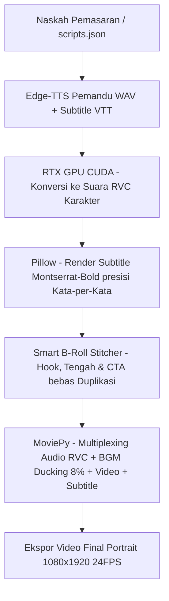

# 🎬 AutoVideo-RVC: AI Short-Form Video Generator with Local RVC Voiceover 🚀

[](https://www.python.org/)
[](https://developer.nvidia.com/cuda-toolkit)
[](https://opensource.org/licenses/MIT)
[](https://github.com/RVC-Project/Retrieval-based-Voice-Conversion-WebUI)

**AutoVideo-RVC** adalah sebuah mesin otomatisasi (*engine*) pengeditan dan pembuatan video vertikal promosi massal (9:16 untuk TikTok, Reels, dan Shorts) secara lokal. Proyek ini mengintegrasikan **Edge-TTS** (suara pemandu alami), **RVC (Retrieval-based Voice Conversion) V2 lokal berbasis akselerasi GPU NVIDIA (CUDA)** untuk mengubah suara menjadi karakter imut/premium, **Pillow** untuk render subtitle Montserrat-Bold secara dinamis, dan **MoviePy** untuk visual-audio stitching cerdas bebas duplikasi scene.

---

## ✨ Fitur Unggulan

* **🔊 Local RVC GPU-Accelerated Voiceover:** Mengubah teks menjadi pengisi suara karakter imut (seperti Furina/anime) secara instan dan 100% offline menggunakan kartu grafis NVIDIA Anda (CUDA).
* **🎛️ Golden Balance Speec & Pacing (+20% Speed):** Kecepatan suara pemandu disesuaikan secara proporsional untuk platform media sosial masa kini demi menjaga tingkat retensi penonton tetap tinggi.
* **🏷️ Zero-Duplicate Smart Visual Stitcher (Scene Pooling):** Logika penyusunan klip B-roll yang secara otomatis mendeteksi dan menaruh klip produk di awal video (Hook) & akhir video (CTA), serta menyaring klip yang sudah terpakai agar tidak ada scene yang berulang ganda dalam satu video.
* **💬 dynamic Gen-Z Burnt-In Subtitles:** Subtitle tebal berwarna kuning cerah dengan garis luar (*outline*) hitam solid, dibatasi maksimal 2 kata per cue secara presisi (sinkronisasi kata-per-kata menggunakan *word boundary*).
* **🎵 Auto-Music Mix & Ducking:** Backsound dipilih secara acak dari library Anda dan volumenya diturunkan secara dinamis hingga **8% (ducking)** saat suara AI sedang berbicara agar artikulasi tetap terdengar jelas dan profesional.
* **📊 Strict Marketing Framework Configurator:** Konfigurasi naskah diatur secara ketat mengikuti kerangka kerja pemasaran digital berkonversi tinggi: **4 Promo, 4 Problem-Solution, 4 Edukasi, 4 Testimoni, dan 4 Hardselling / Duet Bundling**.

---

## ⚙️ Arsitektur Aliran Data (Dataflow Architecture)

Sistem memproses teks naskah dan potongan klip mentah menjadi video final beresolusi tinggi melalui alur kerja otomatis berikut:



---

## 🛠️ Panduan Instalasi (Lokal Windows/Python 3.12)

Menginstal RVC dan dependensi AI secara lokal pada Python 3.12 dapat menjadi tantangan karena beberapa library machine learning membutuhkan penyesuaian khusus. Ikuti langkah-langkah di bawah ini:

### 1. Klon Repositori & Setup Environment
Buka terminal Anda dan jalankan perintah berikut:
```bash
git clone https://github.com/USERNAME/AutoVideo-RVC.git
cd AutoVideo-RVC
python -m venv venv
venv\Scripts\activate
```

### 2. Instalasi PyTorch & CUDA Toolkit
Pastikan GPU NVIDIA Anda aktif dan CUDA Toolkit (disarankan 12.1 atau terbaru) terinstal di sistem Anda. Instal PyTorch yang terakselerasi CUDA:
```bash
pip install torch torchvision torchaudio --index-url https://download.pytorch.org/whl/cu121
```

### 3. Instalasi Dependensi Core & Library Machine Learning
Instal dependensi core untuk pengolahan video-audio serta parser Edge-TTS:
```bash
pip install numpy==1.26.4 edge-tts Pillow moviepy
```
> **PENTING:** Gunakan `numpy==1.26.4` untuk memastikan keserasian penuh pustaka RVC di Python 3.12.

### 4. Instalasi RVC Engine & Pustaka Fairseq Khusus Windows
Instal library RVC-Python dan modul Fairseq menggunakan *pre-compiled wheel* khusus Windows untuk mencegah error kompilasi C++:
```bash
pip install rvc-python
pip install https://github.com/BlueAmulet/fairseq/releases/download/ci_build/fairseq-0.13.2-cp312-cp312-win_amd64.whl
```
> Jika terjadi kendala pada pustaka Pillow, silakan bersihkan dan pasang ulang: `pip install --force-reinstall Pillow==11.3.0`

### 5. Pengunduhan Base Models (RVC Dependencies)
Generator membutuhkan beberapa model dasar RVC yang harus diletakkan pada folder cache sistem Anda. Jalankan script Python berikut sekali saja untuk mengunduh model dasar secara otomatis:
```python
from rvc_python.dependency import download_dependencies
download_dependencies()
```
*Script ini akan mengunduh file berikut ke direktori pustaka lokal Anda:*
* `hubert_base.pt`
* `rmvpe.pt`
* `rmvpe.onnx`

---

## 📁 Struktur Folder & Aset

Pastikan Anda menyusun folder proyek Anda sebagai berikut sebelum menjalankan generator:

```text
AutoVideo-RVC/
├── fonts/
│   └── Montserrat-Bold.ttf        # Font premium untuk burnt-in subtitle
├── music_input/
│   ├── bgm_ceria.mp3              # File backsound format MP3
│   └── bgm_lofi.mp3
├── RVC/
│   └── Furina/
│       ├── Furina_e170_s54910.pth                       # Model suara RVC utama
│       └── added_IVF4312_Flat_nprobe_1_Furina_v2.index  # File index suara RVC
├── video_input/
│   ├── POC_Cabai/                 # Folder klip mentah untuk Produk A
│   │   ├── produk_A_fitur.mp4
│   │   └── broll_kocor.mp4
│   └── Perisa_Cabai/              # Folder klip mentah untuk Produk B
│       ├── produk_B_tampilan.mov
│       └── broll_semprot.mp4
├── output/                        # Folder hasil render akhir video (9:16)
├── batch_generator.py             # Script utama generator massal 40 video
└── README.md                      # Dokumentasi Proyek
```

---

## 🚀 Cara Menjalankan Rendering Massal

### Langkah 1: Siapkan Konfigurasi Naskah
Buka file `batch_generator.py`, sesuaikan daftar naskah dan alokasi video pada array `VIDEOS_CONFIG`.

### Langkah 2: Jalankan Generator!
Jalankan program utama melalui terminal dengan virtual environment yang sudah aktif:
```bash
python batch_generator.py
```

Sistem akan langsung mendeteksi ketersediaan CUDA dan model RVC Anda secara otomatis:
```text
===========================================================================
      AI BATCH AUTO-EDITOR: MEMPROSES TOTAL 40 VIDEO DUAL-PRODUK (MoviePy 2.x)
      RVC DETECTED: MENGGUNAKAN SUARA AI FURINA via GPU RTX 3060
===========================================================================
Aset Musik Latar Terdeteksi: 3 file.

[VIDEO 1/40] Produk: POC Cabai | Kategori: Promo...
 -> Mengonversi suara ke Furina RVC via GPU RTX 3060...
 -> [SUCCESS] Konversi RVC Furina Berhasil!
 -> Voiceover berhasil disiapkan. Durasi: 20.40 detik.
 -> Menggunakan musik latar acak: bgm_lofi.mp3
 -> Merender file final ke: output/POC_Cabai_Promo_1.mp4...
[SUCCESS] Video 1 selesai dibuat!
```

---

## 💡 Tips & Kustomisasi Parameter RVC

Di dalam program utama `batch_generator.py`, Anda dapat menyesuaikan karakter suara AI Furina RVC dengan mengubah parameter pada baris berikut:
```python
rvc_inf.set_params(f0up_key=6, f0method="rmvpe", index_rate=0.2, protect=0.33)
```

* **`f0up_key=6`**: Menaikkan nada vokal setinggi 6 oktaf agar menghasilkan karakter suara cewek yang imut dan ceria khas anime. Gunakan `f0up_key=0` jika suara pemandu asli sudah sesuai dengan jenis kelamin model suara RVC.
* **`f0method="rmvpe"`**: Algoritma pitch extraction terbaik dan termodern untuk menghilangkan suara serak, husky, atau kresek-kresek yang sering muncul di metode lama seperti `"pm"`.
* **`index_rate=0.2`**: Menjaga logat asli pengucapan bahasa Indonesia agar tetap 100% natural, namun dengan balutan warna vokal model RVC. Angka yang terlalu tinggi (misalnya `0.8`) akan membuat intonasi terdengar kaku atau logat asing.
* **`protect=0.33`**: Melindungi konsonan tajam dan nafas alami agar tidak terdistorsi selama proses konversi suara.

---

## 📄 Lisensi
Proyek ini dilisensikan di bawah **[MIT License](LICENSE)**. Anda bebas untuk membagikan, memodifikasi, dan menggunakan proyek ini baik untuk keperluan personal maupun komersial secara cuma-cuma.

---

## 🤝 Kontribusi
Kontribusi, perbaikan bug (*pull request*), dan saran fitur baru sangat disambut hangat! Silakan buat *Issue* baru untuk berdiskusi atau ajukan *Pull Request* langsung ke repositori ini. 

*Dibuat dengan ❤️ untuk komunitas otomatisasi kreator konten oleh [NAMA_ANDA].*
